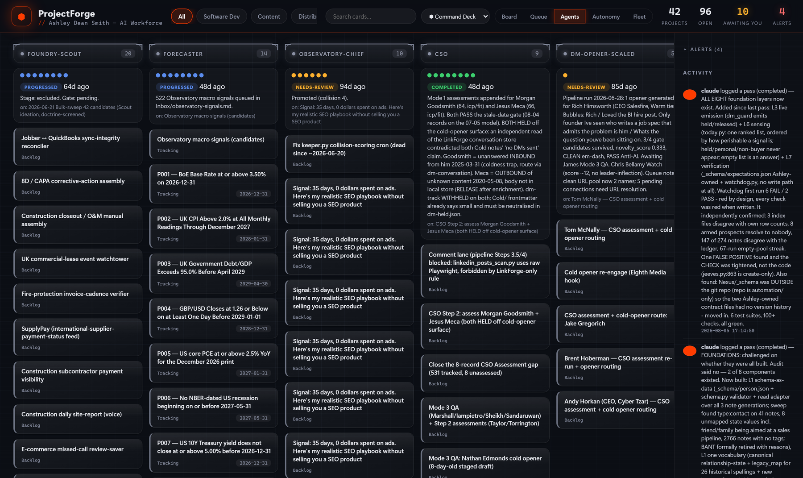

## What it is

ProjectForge is a work board, like a Trello board, that runs on your own computer and is written for AI agents. Each card is a single piece of work. Each card has an owner: one of your Claude Code agents, or you.

The board has up to 8 columns. **Awaiting You** comes first, because it is the only column that needs you. Then Backlog, Ready, In Progress, Blocked, Review and Done. An 8th column, Tracking, appears once another program sends it facts to show. On the right is a live list of who did what and when, and refused changes show there in red.


Click a card and you see its full record: notes, checklist, a link to a person in your CRM vault, every work report an agent wrote against it (what it did, which files it made, the result, the next step), and every handover from agent to agent.

The board itself contains no AI. It stores the work and it enforces these rules:

1. **Managers open cards.** You choose which of your agents are managers. Every other agent is a worker.
2. **Workers only add to a card.** A worker can write a work report, a handover, a comment or an escalation (a flag saying it needs a person). It can never open a card or move one.
3. **Only the orchestrator moves cards.** The orchestrator is a single Claude Code session, started by the `/forge-run` command. It is the only agent allowed to move a card between columns. You can move cards too.
4. **Awaiting You is yours.** The orchestrator may put a card into it. Only you take a card out.

A handover between agents is refused unless it carries 5 fields: what was done, the decisions and why, where the work stands, what to do first, and warnings.


## Why you would want it

Once you have more than a handful of agents, 3 problems appear.

- **Nobody can see what happened.** An agent finished a job on Tuesday. On Friday you, or another agent, have no written record of which files it made or what it left undone. The board keeps that record on the card.
- **Agents trip over each other.** An agent marks another agent's work as finished, or 2 runs pick up the same job. Only the orchestrator moves cards, so "this is now done" is decided in a single place, and a card can be claimed only while it sits in Ready, so a second `/forge-run` cannot claim it again.
- **Handovers are empty.** "Handed over to the editor" tells the editor nothing. The 5-field handover makes the first agent write down what the second agent needs.

It also gives you a column that is yours, Awaiting You, and anything that would reach another person (a post, an email, a message) stops in Review for you to check. The rules are on screen: click **?** at the top right.


## How we built it

Ashley built the original for his own agents. Every date and number below comes from his build records. The pictures in this section are his real board, captured on 2026-09-22 from a copy of his database (the data was last written on 2026-08-07).


### 2026-06-12: the board in 1 day

Ashley built ProjectForge in a single day as a "work operating system" for his agents. It had a SQLite database (a single file on disk), a web server on port 3020 written in plain Python with no extra libraries, a hand-written JavaScript board, and a markdown copy of the board saved into his vault. He kept the engine code apart from his own settings so it could be packaged for other people. This download is that packaging.

The same day he added an always-on background program that checked the board every 15 minutes for overdue, stale, stuck and unowned cards, and archived cards done more than 14 days earlier. It used no AI.

### 2026-06-13: other systems feed in, and the orchestrator loop

Small scripts, called adapters, read Ashley's other systems and pushed their work onto the board every 30 minutes. Re-running never created copies: each card was matched on the source program plus that program's own ID.

Then the orchestrator loop: `/api/next` ranks the ready cards, `/api/dispatch` claims a card (Ready to In Progress), and `/api/commit` records the agent's report and moves the card. The `/forge-run` command in Claude Code runs that loop.

He also switched on an autonomous mode: a Windows Scheduled Task that started `claude -p "/forge-run"` with no window every 15 minutes.

2 bugs appeared that day and were fixed:

- The limit of 10 cards in progress was filled by 18 cards that only mirrored facts from other systems, so no real card could ever be handed out. The fix was an 8th column, **Tracking**, that never counts against the limit.
- A card the orchestrator had just claimed could be dragged back to its old column by the next 30-minute sync. The fix was a flag on the card: once the orchestrator has claimed it, a sync may no longer change its column.


### 2026-06-14: git, a desktop app, and the single-writer ruling

The code went into git (33 files, 5,011 lines) and was packaged as a desktop app. Ashley then set the rule this download is built around: managers open cards, workers only add reports, handovers and comments, and only the orchestrator moves a card. The shared tool `forge_agent.py` was built so every agent writes to the board the same way.

He also measured a 7-day starting point: **3 cards done, 18 times Ashley stepped in, 4 cards handed out**. That told him the automatic loop was not yet earning its keep.




### 2026-07-08: the timer was switched off

The board cost nothing to run. The timer did. Every 15 minutes Windows started a fresh Claude session to run `/forge-run`, whether or not there was work, and each start paid for a full session before looking at the board. The board was usually empty.

The surviving log shows **304 passes between 2026-07-04 and 2026-07-08, about 69 a day, and every one found 0 cards to hand out**. Of 40 passes sampled, 0 handed out any work. Ashley's records put the total at about 230 million input tokens over 30 days (that figure is from his notes, not re-measured). On 2026-07-08 he switched it off completely.

His one-line summary: a free board wearing an expensive alarm clock. The fix: never start Claude unless a cheap check shows a card is ready.


> **Note:** On 2026-07-19 a single orchestrator pass was measured on Anthropic's smallest model at that time, run from a folder with no list of agents loaded: it cost $0.094. The cost of a pass depends heavily on how many agents and instructions each session loads.

### 2026-07-19: the rebuild plan and the handover standard

Ashley wrote a new plan in a single day, in 3 rounds: version 1, a critique, version 2, a critique, version 3. The aim: agents that work like independent employees, with Ashley needed "barely ever". The same evening he ruled that "handoff occurred at [time]" is not a handover, and set the 5 fields. The first stage of the plan made timestamps honest (a sync no longer counts as activity) and made every write name who made it.

The plan said the database should refuse a thin handover. **That refusal was never built** in the original. The rule only worked when the person recording the work remembered it.

### 2026-09-22: what changed for this download

- **The handover refusal is built.** The board refuses a handover missing any of the 5 fields, and the decisions field must say why (it must contain "because", or say "none").
- **The rules are checked inside the database code**, not only in the agents' instructions, and every refusal is written to the Activity list in red, with the agent's name.
- **No timer by default.** You run `/forge-run` when you want it. The optional schedule runs a Python check first and exits without starting Claude when nothing is ready.
- **Agents write straight into the database**, so their reports are kept even when the web board is closed. In the original, a report sent while the board was down was not recorded.
- **Safety fixes found in testing on 2026-09-22**, before any member had it: a website you visit can no longer write to the board; every `forge.py` change must name who made it; the orchestrator can no longer take a card out of Awaiting You; a card cannot be claimed twice; a second board on the same port now fails with a message instead of starting silently.
- The "Awaiting Ashley" column is now "Awaiting You". Every folder path comes from a single settings file the installer writes. The desktop app, the adapters written for Ashley's own systems and the self-repair step were left out.


## Pros and cons

| | For | Against |
|---|---|---|
| Cost | The board, the health check and the CRM reader use no AI and cost nothing to run. | Each `/forge-run` is a full Claude Code session. Ashley's timer ran about 69 of them a day for no work. Only run it when something is ready. |
| Visibility | A single place to see what every agent did, on which job, with which files and what comes next. | Agents only write to it if their instructions say so. Before 2026-06-14, 0 of Ashley's 77 agent files wrote to his board. |
| Safety | Only the orchestrator moves cards; only you take a card out of Awaiting You; outward work stops in Review; refusals show in red. | It is a guard rail, not a lock. An agent that gives a false name (for example `--actor you`) gets through. The rules stop honest mistakes, not a determined liar. |
| Handovers | Thin handovers are refused at the database. | Agents need a few extra lines of instruction to write good ones. |
| Busy-work | A queue makes waiting work obvious. | A board that hands out work invites agents to create work. Ashley's first week: 3 cards done against 18 times he stepped in. His board on 2026-09-22 had 74 cards in Backlog and 0 being worked. |
| Size | About 5,000 lines of plain Python and plain JavaScript. Your own Claude can read and change all of it. | With 3 to 5 agents, a simple list in your vault may be enough. The board pays off when agents hand work to each other. |
| Time | Install takes about 5 minutes. | Wiring your agents in (the lines for CLAUDE.md and each agent file) takes 20 to 30 minutes. |


## Before you start

| You need | How to check |
|---|---|
| Python 3.9 or newer (tested on 3.13) | Open a terminal and type `python --version`. On a Mac use `python3 --version`. |
| Git | `git --version` |
| Claude Code, logged in | `claude --version`. Tested on version 2.1.278 on 2026-09-22. |
| Your second brain vault | You know its folder, for example `C:\Users\<you>\Documents\Second Brain`. |
| Your agents folder | Usually `C:\Users\<you>\.claude\agents` (Windows) or `~/.claude/agents` (Mac). |
| Optional: your CRM vault | The folder that contains `Today.md` and `People/`. |
| Optional, for the tests: pytest | `python -m pytest --version`. If missing: `python -m pip install pytest`. |

Node.js is not needed. Nothing is installed from the internet: the board uses only the Python standard library.


## Install it

1. Open a terminal in the folder where you keep your tools, for example your Documents folder.
2. Download the code and start the installer:

```
git clone https://github.com/OUTLIERS-ai/outliers-ws-03-projectforge && cd outliers-ws-03-projectforge && python install.py
```

3. Answer the 8 questions. Most offer a default in square brackets; press Enter to accept it. Questions 4 and 5 have no default: press Enter for nobody.
   - Your second brain vault folder.
   - Your CRM vault folder, or `none`.
   - Your agents folder. The installer lists every agent it finds.
   - Which agents are **managers** (may open cards). Press Enter and only you open cards.
   - Which agents send work to other people. Their finished cards stop in Review.
   - What the board calls you (default `you`). Remember it: you type it after `--actor` in terminal commands.
   - Where the `/forge-run` command goes: `user` (every Claude Code session) or `vault` (only sessions in your second brain).
   - The board summary note: pressing Enter writes it into your vault at the path shown. Type `none` if you do not want one.
4. The installer shows every file it is about to write and asks "Go ahead?". Type `y`.
5. When it worked you see a list of `done:` lines like this:


6. Open the board: `python forge.py serve`, then visit `http://127.0.0.1:3020` in your browser. There is no login and no wait. The terminal prints the address and then stays quiet while the board runs. That is normal. Leave the window open; press Ctrl+C in it to stop the board. The name under "ProjectForge" comes from `workspace` in `config.json`; change it there.


7. The board opens empty, with 3 steps on the left. Your first card: click "+ Add card" under Ready. Because there is no project yet, the form asks you to name one, and the card and the project are made together.


8. Open the file `data/CLAUDE-snippet.md` inside the download folder. Paste the first part into the CLAUDE.md that every session reads, `C:\Users\<you>\.claude\CLAUDE.md` (or the CLAUDE.md in your vault if you chose `vault` at question 7). Paste the second part into each worker agent's file. This is what makes your agents log their work.
9. In Claude Code, type `/forge-run dry`. It reports what it would do and changes nothing.

> **Tip:** Want to see a full board first? Run `python tools/demo_board.py --out demo --serve` and open `http://127.0.0.1:3029`. It builds a separate demo board of made-up work, with a made-up CRM vault, and does not touch your real one.

> **Note:** If a file called `forge-run.md` already exists in your commands folder, the installer copies it to `forge-run.md.bak-<date>` before replacing it. Running the installer a second time with the same answers changes nothing. `python install.py --uninstall` asks you to type y, then takes the command out, moves the agents' tool into a folder named `projectforge.removed-<date>`, puts your own old command back (even if you installed twice), and leaves your board data alone.

## Using it day to day

**Adding work on the board.** "+ Project" sits at the top of the screen. "+ Add card" sits at the foot of each column, with a project picker and an owner picker. The owner picker only lists you and your real agents, so a typo cannot create a made-up agent.

**Adding work from the terminal.** Make a project first; it prints the project's id. Then add a card to it. Every command that changes the board ends with `--actor` and your board name (the answer to question 6; `you` if you kept the default):

```
python forge.py add-project "Content week 39" --dept content --actor you
python forge.py add-task pf-p-5baff3 "Draft 3 posts" --status ready --agent writer-bot --actor you
```

The departments are content, sales, delivery and operations; any other is refused. `python forge.py projects` lists every project with its id.


**What your agents run.** The installer puts the agents' tool, `forge_agent.py`, in the `.claude\projectforge` folder inside your home folder. It is not in the download folder, so to try it yourself give its full path:

```
python "%USERPROFILE%\.claude\projectforge\forge_agent.py" open --agent content-lead --dept content --project "Content week 39" --title "Write the newsletter" --assignee writer-bot
```

On a Mac the path is `~/.claude/projectforge/forge_agent.py`. The full list of its commands is under "Every command and setting" below.

**Letting the agents work.** When cards are sitting in Ready, type `/forge-run` in Claude Code (or `/forge-run 3` to run at most 3 cards). The orchestrator:

1. checks how many cards can be handed out, and stops straight away if the answer is 0;
2. moves Backlog cards that have an owner to Ready. It gives an ownerless card an owner only if you set up keyword routing (idea 6 below); otherwise the card waits for you to pick an owner;
3. for each ready card: claims it, starts the owner agent with the card's full history, records the agent's report, and moves the card to the column its result points to. "progressed" puts the card back in Ready for the next run.

> **Warning:** Backlog is not a waiting room. Any Backlog card with an owner is handed out on the next `/forge-run`. To park a card, give it the tag `someday` (or `icebox` or `parked`).

**Reading a card.** Click anywhere on it. The top shows the owner, the CRM person link and the checklist. Further down are the work reports and the handovers, each with its 5 fields. A handover also makes the receiving agent the card's new owner. Edits at the top are kept when you add a tag, tick the checklist or comment; if you press Escape with unsaved edits, the board asks first. The board refreshes every 10 seconds, but never while you are typing.


**The Queue tab** shows the Ready cards in the order they would be handed out (priority, then due date, then age) and says why a card cannot go: it has no owner, it is yours, its owner is not one of your agents, or the in-progress limit is reached.


**The Agents tab** shows every agent you installed, managers first, each with a role badge, its open cards and its last 8 results as coloured dots. A key to the dots is at the top.


**Your column.** Check Awaiting You once a day. Everything there needs you: a decision, a call, a sign-off. Click the "awaiting you" number at the top to jump to it.

**Refusals and escalations.** The "refused today" number at the top counts the changes the board refused. Click it, or "show refusals only" in Activity, to see who tried what. An agent that needs you can run `forge_agent.py escalate`; that shows in red as NEEDS A PERSON and does not move the card.


**Health check.** The board runs a no-AI check when it starts and every 10 minutes: overdue, due soon (2 days), stale (5 days), stuck in Blocked (3 days), no owner, and too many cards in a column. The cards it finds are listed under Alerts on the right (with the time of the last check) and at the top of the summary note. It also sends a card back to Ready if its agent never reported within 45 minutes, and archives Done cards after 14 days. `python forge.py hygiene` runs the same check once and prints the cards.

**Letting it run by itself (optional).** `python tools/run_if_ready.py` checks first and starts Claude only if a card is ready. It prints 1 line and writes what happened to `data/run_if_ready.log`, not the screen; a pass can take up to 45 minutes. It starts Claude in "dontAsk" mode: nobody is there to answer questions, so it may use exactly the board commands below, plus whatever you have already allowed in your own Claude Code settings, and nothing else. This was tested live on 2026-09-22: the board commands ran and every other command was refused.


## Fit it to your own AI system

Each idea below comes with a prompt you can paste into Claude Code, opened in the ProjectForge folder. Some ideas use settings you will find in `config.json` after installing; `config.example.json` shows them all filled in with examples.

### 1. Cards from your CRM's Today page

The download includes `adapters/crm_today.py`. It reads the ranked table on `Today.md` in your CRM vault and makes a card for each person in Awaiting You, linked to that person's note in `People/`. The table needs a rank number, the person's name (matching a file in `People/`), why, and when:

```
| 1 | [[Dan Pike]] | Asked about payroll | Call back today |
```

`[[People/Dan Pike]]` and `[[Dan Pike|Dan]]` work too. Run `--dry-run` first: "(no person note found)" means the name does not match a file in `People/`. Running it again updates the same cards instead of copying them. It never sends anything. On the card, and in the summary note, the person's name opens their note in Obsidian. To hand these cards to a research agent instead of you, set `crm_today.owner` in config.json.


```
Run python adapters/crm_today.py --dry-run and show me the result. If it looks right, run it for real. Then add one line to my CRM's morning routine so that after Today.md is rebuilt, crm_today.py runs straight after it.
```

### 2. Your second brain agents as owners and managers

```
Read config.json. Then read every agent file in my agents folder. Suggest which agents should be managers (they plan work and hand it out) and which are workers (they do a single kind of job). Show me the list, and when I agree, re-run python install.py with --managers set to the ones I approve.
```

### 3. Teach each agent to leave a proper report

```
Open data/CLAUDE-snippet.md. For each worker agent file in my agents folder, add the WORK REPORT paragraph at the end if it is not already there, and add a line telling it to log that report with forge_agent.py pass. Show me the change for each file before saving it, and back up each file first.
```

### 4. Content engine runs as cards

```
Read my content engine folder at <path to your content engine>. Write adapters/content_engine.py, modelled on adapters/crm_today.py, that creates a card per content piece the engine has made in the last 7 days, with the draft's file path in context_ref, owned by my editor agent, starting in Review. It must never publish anything. Add "content-engine" to federate_sources in config.json. Add a test in tests/ and run python -m pytest -q.
```

### 5. "Awaiting You" in your daily note

```
Write tools/daily_block.py. It reads the board and writes a section called "Waiting for me" into today's daily note in my second brain (find the daily notes folder by looking at my vault), listing every card in Awaiting You and every card in Review. Replace only that section, never the rest of the note, and write via a temporary file and os.replace. No AI.
```

### 6. Route cards by keyword

```
In config.json, fill intake.routing so that a card with "podcast" in its title goes to my podcast agent, "invoice" goes to my admin agent, and "thumbnail" goes to my design agent. Use the real agent names from config.json "agents". Then add a test to tests/test_store.py proving a card is routed correctly, and run the tests.
```

### 7. Every card must name the number it moves

Ashley's worry about busy-work was agents creating work to stay busy. A cure is to refuse any card that does not say which goal it serves.

```
Add a "goal" field to cards in engine/db.py (with a migration like the others). Make open_card refuse a card whose goal is empty, with a clear message. Show the goal on the card in the viewer. Add tests for the refusal and run python -m pytest -q.
```

### 8. The optional schedule, set up safely

```
Run python tools/schedule.py --print and explain each line to me. Then set schedule.model in config.json to "sonnet" and schedule.every_min to 120. List the tools my agents need for their work that are not in allowed_tools() in tools/run_if_ready.py, and suggest what to put in schedule.extra_allowed_tools. Do not run python tools/schedule.py --install until I say yes.
```

### 9. Limits per agent

The file name decides which agent a limit file applies to: `cards/writer-bot.json` limits writer-bot.

```
For my 3 busiest worker agents, create a file in cards/ modelled on cards/example-agent.json.example, named after the agent (for example cards/writer-bot.json), and set its "slug" to the agent's exact name. Limit each to its own department and to 5 hand-outs a day. Run python forge.py cards --validate and show me the result.
```

## Every command and setting

The whole download at a glance, then every command. Anything that changes the board from the terminal needs `--actor <your board name>`.


**`forge.py`: your commands.**

| Command | What it does |
|---|---|
| `serve [--port 3020]` | Opens the web board and runs the health check every 10 minutes. |
| `daemon [--port] [--interval 10]` | The same as serve, with its own minutes between health checks. |
| `list` | Open cards in the terminal. |
| `projects` | Every project and its id. |
| `add-project "Title" --dept content [--summary "..."] --actor you` | A new project; prints its id. |
| `add-task <project-id> "Title" [--status ready] [--agent writer-bot] [--notes "..."] [--context <link or file>] [--crm-person "People/Dan Pike.md"] --actor you` | A new card. The 8 columns are backlog, ready, in_progress, blocked, review, awaiting_you, done, tracking. |
| `move <card> <column> --actor you` | Moves a card. |
| `set <card> [--due 2026-10-02] [--priority low/normal/high/urgent] [--agent <name>] [--crm-person ...] --actor you` | Changes a card's details. |
| `archive <card> [--restore] --actor you` | Hides a card, or brings it back. Nothing is ever deleted. |
| `comment <card> "text" --actor you` | Adds a comment. |
| `pass <card> <agent> "summary" [--result ...] [--outputs a.md,b.md] [--next "..."] [--intent ...]` | Logs a work report for an agent. Never moves the card. |
| `handoff <card> <from> <to> --done --decisions --state --next-first --warnings [--context]` | A 5-field handover from the terminal. |
| `waiting [--json]` | How many cards a `/forge-run` could hand out now, counting owned Backlog cards it will move to Ready first. Writes nothing. |
| `next [--limit 5] [--json]` | The Ready cards in hand-out order, with the reason any card cannot go. |
| `show <card> [--json]` | A card in full. |
| `metrics [--days 7]` | Cards finished, cards sent backwards, how often you stepped in. |
| `hygiene` | Runs the health check once and lists the cards it found. |
| `mirror` | Rewrites the summary note now. |
| `cards [--validate]` | Lists or checks the per-agent limit files. |
| `intake`, `dispatch <card>`, `commit <card> <agent> "summary" --result ... [--key]` with `--actor orchestrator` | The orchestrator's own steps. `--key` stops the same report being logged twice. |

Results are completed, progressed, blocked, failed and needs-review. `--intent` (on pass, handoff and commit) records what kind of message it is: DELEGATE, REQUEST, INFORM, PROPOSE, ACCEPT, REFUSE, FAILURE, QUERY or ESCALATE.

**`forge_agent.py`: your agents' tool.** It writes straight into the database, so it works whether or not the web board is open. It finds the board through `forge_agent.json` next to it, or the `FORGE_DIR` setting.

| Command | Who |
|---|---|
| `mywork <agent>` | Anyone: the agent's open cards and last report. |
| `card <card>` | Anyone: reads a card, its last 2 handovers and last 4 reports. |
| `pass --card --agent --summary [--result] [--outputs] [--next] [--key]` | Any agent. |
| `handoff --card --from --to --done --decisions --state --next-first --warnings [--context]` | Any agent. Makes the receiver the owner. |
| `comment --card --agent --text` | Any agent. |
| `escalate --card --agent --note` | Any agent. Shows in red as NEEDS A PERSON; does not move the card. |
| `open --agent <manager> --dept --project --title [--assignee] [--status backlog/ready] [--context] [--notes] [--crm-person]` | Managers only. A new project name makes a new project. |

**Other scripts.** `install.py` also takes every answer as a setting, for scripts: `--yes`, `--second-brain`, `--crm`, `--agents-dir`, `--managers`, `--outward`, `--name`, `--commands`, `--summary-note`, `--port`, and `--uninstall`. `tools/run_if_ready.py [--dry-run]` checks and starts Claude only if needed. `tools/schedule.py --print / --install [--every 60] / --remove` shows, switches on or switches off the optional schedule (a hidden Windows task, or a launchd job on a Mac). `tools/demo_board.py --out demo [--serve] [--port 3029]` builds the demo. `adapters/forge_client.py` lets your own programs send cards to the board over its web address.

**Settings in `config.json`.**

| Setting | What it controls |
|---|---|
| `workspace`, `human`, `orchestrator` | The name under the logo, your board name, the orchestrator's name. |
| `managers`, `agents`, `outward_owners` | Who may open cards; your real agents (the owner picker); whose finished work stops in Review. |
| `departments` | The 4 departments, their colours, and an optional `lead` agent who gets ownerless cards. |
| `hygiene` | `check_every_min` 10, `stale_days` 5, `blocked_days` 3, `due_soon_days` 2, `done_archive_days` 14, `dispatch_ttl_min` 45, and the column limits: In Progress 10, Review 8, Awaiting You 10. |
| `intake` | `auto_pickup`, the parking tags, and keyword `routing`. |
| `crm_today.owner` | Give CRM cards to an agent instead of you. |
| `federate_sources` | Programs allowed to push cards in (default `crm-today`). Anything else is refused. |
| `schedule` | `every_min`, `model`, `extra_allowed_tools`, and `claude_path` (saved when you install the schedule). |
| `summary_note`, `second_brain`, `crm_vault`, `port`, `db_path` | Folder paths, the board's port and its database file. |

**The board itself.** Search box and department buttons filter every tab. 5 colour themes (Command Deck, Synthwave, Terminal, Paper and Minimal) sit in the menu at the top. Drag a card between columns, or up and down inside a column; dragging a card that an agent is still working on into Done asks first. A card has tags, a due date, a priority, notes, a checklist and an archive button. The **×** on an alert dismisses it. Keyboard users can Tab to a card and press Enter to open it.

**The web address, for your own programs.** The board answers on `http://127.0.0.1:3020/api/...`. Reads: `state`, `events`, `agents`, `alerts`, `metrics`, `cards`, `next`, `waiting`, `task/<card>`. Writes (JSON only, from your own computer, with an `actor`): `open`, `pass`, `handoff`, `federate`, `task/add`, `task/move`, `task/update`, `task/tags`, `task/checklist`, `task/comment`, `task/archive`, `task/reorder`, `project/add`, `project/update`, `alert/dismiss`, and the orchestrator's `intake`, `dispatch`, `commit`.

**Also in the folder:** `README.md`, `WHAT-I-STOLE.md` (the ideas this borrows and their licences), `LICENSE` (MIT), `guide/` (this guide and its pictures), and `tests/` (83 tests: `python -m pytest -q`).

## When it goes wrong

These are the real faults from Ashley's build and from testing this download, with the fix for each.

| What you see | Why | Fix |
|---|---|---|
| Your Claude usage climbs while nothing gets done. | A timer is starting Claude on an empty board. This was Ashley's biggest automatic cost in July 2026. | Never put `claude -p "/forge-run"` on a timer. Use `tools/run_if_ready.py`, which exits without starting Claude when nothing is ready. |
| Nothing is ever handed out, but cards sit in Ready. | The in-progress limit (default 10) is full, or the owner is not one of your agents. In the original, 18 mirror cards filled the limit. | Open the Queue tab: it says why each card is waiting. Put cards that only report a fact from another system in Tracking, which never counts. |
| A card jumps back to an older column. | Another program re-sent it with its old column. | Already fixed: once the orchestrator claims a card, or while it is in Awaiting You, a re-send can no longer change its column. |
| "refused: ... is a worker and may not move a card" | The single-writer rule. An agent tried to move a card. | Working as intended. The agent should log a report with `forge_agent.py pass`; `/forge-run` moves the card. |
| "handover refused - a handover must carry all 5 fields" | A thin handover. | Fill in `--done` (name the files), `--decisions` (with "because"), `--state`, `--next-first` and `--warnings` ("none" is fine). |
| "the following arguments are required: --actor" | Every `forge.py` change must say who made it. | Add `--actor` and your board name, for example `--actor you`. |
| "no project with the id ..." | A wrong project id. | `python forge.py projects` lists them. |
| "unknown department 'marketing'" | Only the departments in config.json are accepted. | Use content, sales, delivery or operations, or add a department to config.json. |
| "Port 3020 is already in use" | A second copy of the board, or another program, has the port. | Close the other board's terminal window, or run `python forge.py serve --port 3021`. |
| Your vault note was overwritten by a demo board. | During research on 2026-09-22, a copied settings file still pointed at a real vault note. It was restored from git. | The demo board never writes a summary note, and the installer shows the note's path before writing it. |
| The orchestrator reports "bad json". | In the original, an em dash typed into a command's text broke the request. | `/forge-run` now uses `forge.py` commands instead of web requests. Still type hyphens, not em dashes. |
| An agent says the board was not found. | `forge_agent.json` is missing next to the tool. | Re-run `python install.py`. Or set the environment variable `FORGE_DIR` to the download folder. |
| The unattended run logs "claude not found" (Mac). | A schedule starts with a bare list of program folders. | `python tools/schedule.py --install` saves Claude's full path and adds its folder to the schedule. |


## Download

The code: https://github.com/OUTLIERS-ai/outliers-ws-03-projectforge

Clone and install with a single command:

```
git clone https://github.com/OUTLIERS-ai/outliers-ws-03-projectforge && cd outliers-ws-03-projectforge && python install.py
```


