## What it is

ProjectForge is a work board, like a Trello board, that runs on your own computer and is written for AI agents. Each card is a single piece of work. Each card has an owner: one of your Claude Code agents, or you.

The board has up to 8 columns. **Awaiting You** comes first, because it is the only column that needs you. Then Backlog, Ready, In Progress, Blocked, Review and Done. An 8th column, Tracking, appears only once you connect another program, such as your CRM, that sends in cards that just report a status and are not work for an agent. On the right is a live list of who did what and when, and any change the board refused (for example, an agent trying to move a card it is not allowed to move) shows there in red.

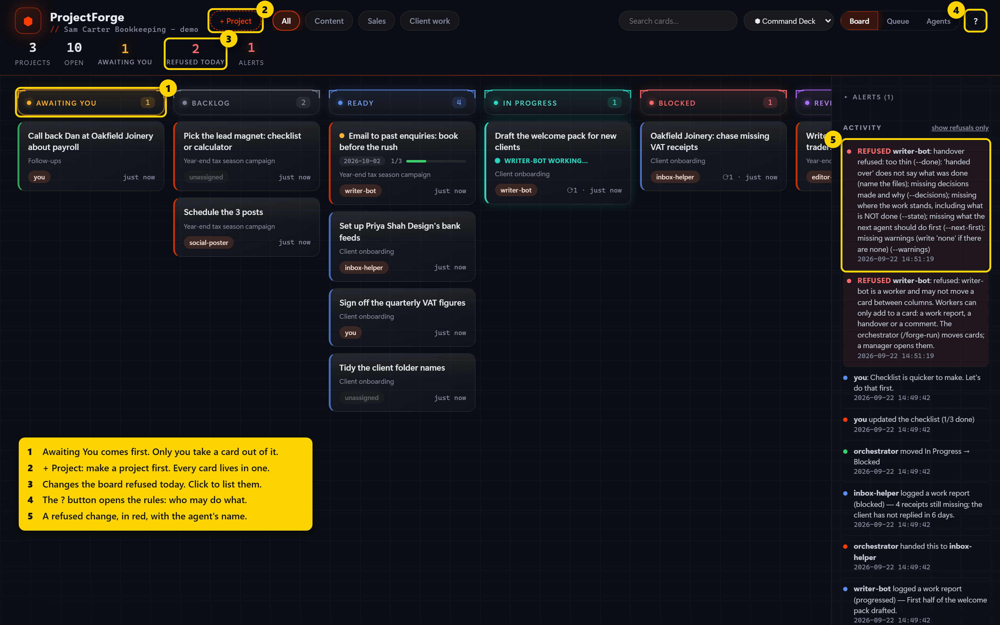

1. The bar that appears when the columns are wider than the window. Click a column name and the board scrolls to it.
2. **+ Add card**, at the top of every column.
3. A red **NEEDS YOU** label: an agent has asked for a person on this card, so the card has moved into Awaiting You. The header counts these under "needs you".
4. The Activity list: every change, newest first, each line naming the card and its project. Refusals and requests for a person are in red. **show refusals only** narrows it to the changes the board refused.

Not every column fits on a laptop screen. When they do not, a bar under the header names every column with its number of cards; click a name and the board scrolls to that column. The Activity list on the right can also be folded away with the **x** beside its heading, which gives the columns another 270 pixels.

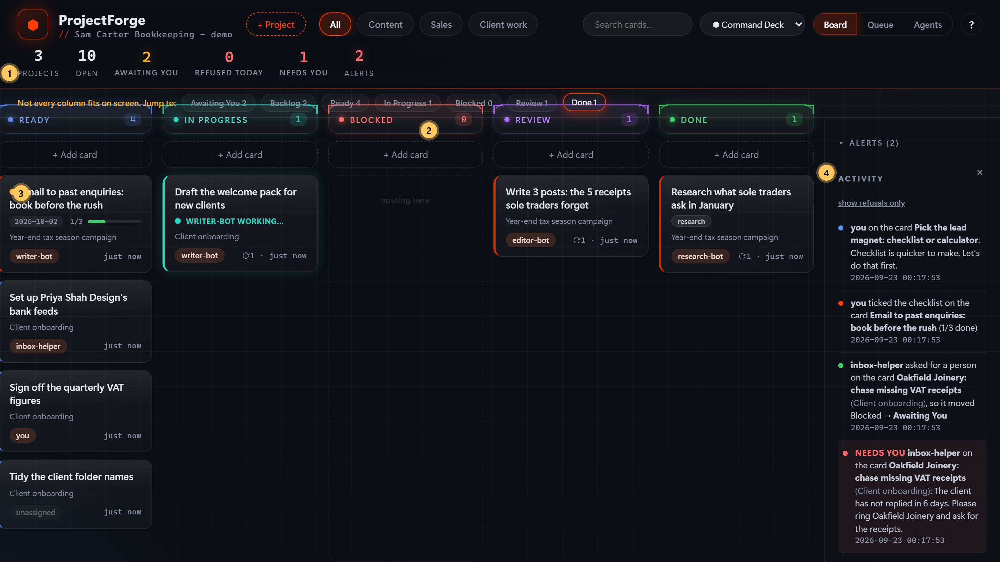

Click a card and you see its full record: notes, checklist, a link to a person in your CRM vault, every work report an agent wrote against it (what it did, which files it made, the result, the next step), and every handover from agent to agent.

The board itself contains no AI. It stores the work and it enforces these rules:

1. **Managers open cards.** You choose which of your agents are managers. Every other agent is a worker.
2. **Workers only add to a card.** A worker can write a work report, a handover, a comment or an escalation (asking for a person: that marks the card NEEDS YOU and the board puts it in Awaiting You). A worker can never open a card, and never chooses which column a card sits in.
3. **Only the orchestrator moves cards.** The orchestrator is a single Claude Code session, started when you type `/forge-run` into Claude Code (the installer adds that command). It is the only agent allowed to move a card between columns. You can move cards too.
4. **Awaiting You is yours.** The orchestrator may put a card into it. Only you take a card out.

A handover between agents is refused unless it carries 5 fields: what was done, the decisions and why, where the work stands, what to do first, and warnings.

This is piece 3 of 4 in the agent workspace. Install them in order: 1 agent-flow, 2 FleetView, 3 ProjectForge, 4 Jeeves. Each one also works on its own.

### Words used in this guide

| Word | What it means here |
|---|---|
| Terminal | The text window where you type commands: PowerShell on Windows, Terminal on a Mac. |
| Agent | One of your Claude Code helpers, each defined by a file in your agents folder. |
| Orchestrator | The 1 Claude Code session, started by typing `/forge-run`, that hands cards to agents and is the only agent allowed to move them. |
| Take a card | What the orchestrator does to a card in Ready: marks it as being worked on and moves it to In Progress. |
| Work report | The written record an agent saves on a card after a job: what it did, files made, result, next step. The command that saves it is called `pass`. |
| A run | 1 start of `/forge-run`, from checking the board to handing out the last ready card. |
| Token | The unit Claude's usage is counted in. 1 token is roughly 3 quarters of a word. |
| 127.0.0.1 and localhost | 2 ways of writing "this computer". An address that starts with either of them opens only on your own computer. |
| Port | The number after the colon in an address such as http://127.0.0.1:3020. It picks out which program on your computer answers. In this set of 4: agent-flow 3001, FleetView 3010, ProjectForge 3020, Jeeves 4040. |
| `--actor` | The part of a command that says who is making the change. |
| Escalation | An agent asking for a person. It marks the card **NEEDS YOU**, counts it in the header, and moves the card into Awaiting You. |
| Health check | A scan with no AI in it that the board runs when it starts and every 10 minutes: overdue cards, stale cards, stuck cards, cards with no owner, and cards whose agent never reported. |
| writer-bot, editor-bot, content-lead | Made-up agent names used in the examples. Type your own agents' names instead. |

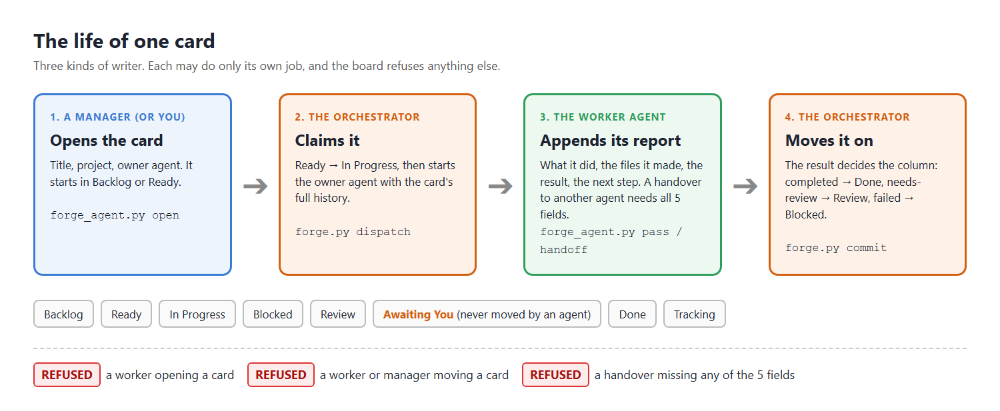

## Why you would want it

Once you have more than 5 agents, 3 problems appear.

- **Nobody can see what happened.** An agent finished a job on Tuesday. On Friday you, or another agent, have no written record of which files it made or what it left undone. The board keeps that record on the card.
- **Agents trip over each other.** An agent marks another agent's work as finished, or 2 runs pick up the same job. Only the orchestrator moves cards, so "this is now done" is decided in a single place, and the orchestrator can only take a card while it sits in Ready, so a second `/forge-run` cannot take the same card again.
- **Handovers are empty.** "Handed over to the editor" tells the editor nothing. The 5-field handover makes the first agent write down what the second agent needs.

It also gives you a column that is yours, Awaiting You, and anything that would reach another person (a post, an email, a message) stops in Review for you to check. The rules are on screen: click **?** at the top right.

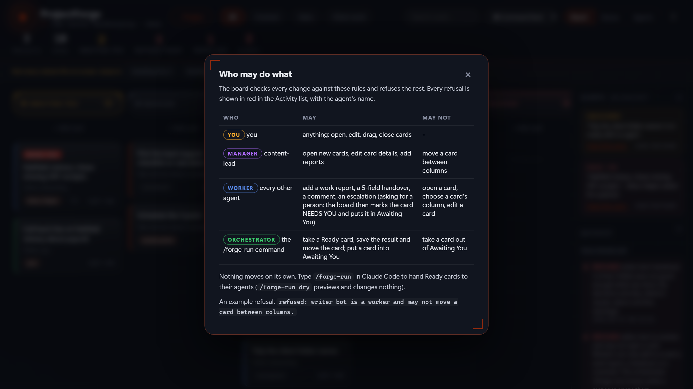

### What it is for

Keeping a written trail of every job your agents do, 1 card per job, each with an owner, a work report and a single place where "this is finished" is decided.

### Works well when

- **Your agents hand work to each other.** A writer finishes and an editor picks up. The 5-field handover makes the first agent write down what the second agent needs.
- **You need Tuesday's work on Friday.** Open the card and read what the agent did, which files it made, and what it left undone.
- **2 sessions could grab the same job.** Only the orchestrator moves cards, and it can only take a card sitting in Ready, so the second `/forge-run` cannot take it again.
- **Something is about to reach another person** (a post, an email, a message). It stops in Review, and nothing leaves until you move it.
- **You want a queue to look at in the morning.** Awaiting You comes first and counts only what actually needs you.

### Does not work well when

- **You put `/forge-run` on a timer against an empty board.** Ashley's ran every 15 minutes. The surviving log shows 304 wake-ups between 2026-07-04 and 2026-07-08 and 0 cards handed out, and it became the largest automatic Claude cost he had. Start it when a cheap check has proved a card is ready, and not before.
- **You want a personal to-do list.** This is a board for agents. Your own errands belong in your daily note: a card here is picked up and acted on by whichever agent owns it.
- **You want anything on a card kept to yourself.** Every note, comment and work report on a card is read by the next agent that touches it. Write cards as if the next reader is a stranger, because it is.
- **You have 3 to 5 agents that work alone.** A simple list in your vault is enough. The board earns its 30 minutes of set-up once agents start handing work along.
- **You expect the rules to catch an agent that lies.** They catch mistakes. An agent that names itself wrongly, by typing `--actor you`, gets through.

## How we built it

Ashley built the original for his own agents. Every date and number below comes from his build records. The pictures in this section are his real board, captured on 2026-09-22 from a copy of his database (the data was last written on 2026-08-07).

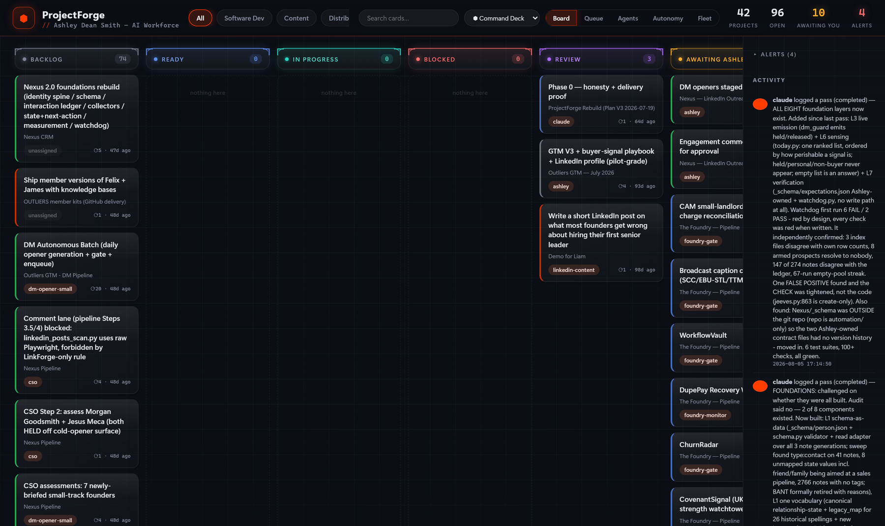

### 2026-06-12: the board in 1 day

Ashley built ProjectForge in a single day as a "work operating system" for his agents. It had a SQLite database (a single file on disk), a web server at the address http://127.0.0.1:3020 written in plain Python with no extra libraries, a hand-written JavaScript board, and a markdown copy of the board saved into his vault. He kept the program's code apart from his own settings so it could be packaged for other people. This download is built from that separated code.

The same day he added an always-on background program that checked the board every 15 minutes for cards that were overdue, untouched for days, stuck, or had no owner, and archived cards done more than 14 days earlier. It used no AI.

### 2026-06-13: other systems feed in, and the loop that hands out work

Small scripts, called adapters, read Ashley's other systems and pushed their work onto the board every 30 minutes. Re-running never created copies: each card was matched on the program it came from plus that program's own reference number for it, so the same item was never added twice.

Then the loop that hands out work: the board ranks the ready cards, marks the top card as taken (Ready to In Progress), and once the agent reports, saves the report and moves the card. The `/forge-run` command in Claude Code runs that loop.

He also made it run by itself: every 15 minutes a Windows Scheduled Task started Claude Code in the background with no window (`claude -p` runs Claude once on a single instruction, then exits) and told it to run `/forge-run`.

2 bugs appeared that day and were fixed:

- The limit of 10 cards in progress was filled by 18 cards copied in from his other systems only to show their status, with no work in them for an agent, so no real card could ever be handed out. The fix was an 8th column, **Tracking**, that never counts against the limit.
- A card the orchestrator had just taken could be dragged back to its old column by the next 30-minute update from the adapters. The fix was a flag on the card: once the orchestrator has taken it, an adapter update may no longer change its column.


### 2026-06-14: git, a desktop app, and the rule that only 1 session moves cards

The code went into git (33 files, 5,011 lines) and was packaged as a desktop app. Ashley then set the rule this download is built around: managers open cards, workers only add reports, handovers and comments, and only the orchestrator moves a card. The shared tool `forge_agent.py` was built so every agent writes to the board the same way.

He also measured a 7-day starting point: **3 cards done, 18 times Ashley stepped in, 4 cards handed out**. 3 finished cards against 18 times he stepped in meant the loop made more work for him than it saved.


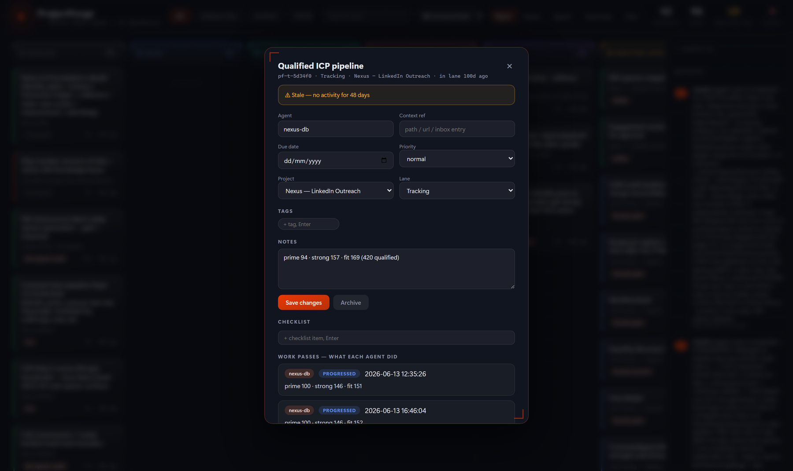

### 2026-07-08: the 15-minute automatic start was switched off

The board cost nothing to run, but starting Claude every 15 minutes did: Windows started a fresh Claude session to run `/forge-run`, whether or not there was work, and each start paid for a full session before looking at the board. The board was usually empty.

The surviving log shows **304 automatic runs of `/forge-run` between 2026-07-04 and 2026-07-08, about 69 a day, and every one found 0 cards to hand out**. Of 40 runs sampled, 0 handed out any work. Ashley's records put the total at about 230 million tokens of text read by Claude over 30 days (that figure is from his notes, not re-measured). On 2026-07-08 he switched it off completely.

So this download never starts Claude unless a check with no AI in it finds a card in Ready.


> **Note:** On 2026-07-19 a single run of `/forge-run` was measured on Anthropic's smallest model at that time, run from a folder with no list of agents loaded: it cost 0.094 US dollars (about 7p). The cost of a run depends heavily on how many agents and instructions each session loads.

### 2026-07-19: the rebuild plan and the handover standard

Ashley wrote a new plan in a single day, in 3 rounds: version 1, a critique, version 2, a critique, version 3. The aim was agents that work like independent employees, with Ashley needed "barely ever". The same evening he ruled that "handoff occurred at [time]" is not a handover, and set the 5 fields. The first stage of the plan stopped a card's "last activity" time changing when an adapter only re-sent the card unchanged, and made every change name who made it.

The plan said the database should refuse a thin handover. **That refusal was never built** in the original. The rule only worked when the person recording the work remembered it.

### 2026-09-22: what changed for this download

- **The handover refusal is built.** The board refuses a handover missing any of the 5 fields, and the decisions field must say why (it must contain "because", or say "none").
- **The rules are checked inside the database code**, not only in the agents' instructions, and every refusal is written to the Activity list in red, with the agent's name.
- **Nothing starts Claude on a clock by default.** You run `/forge-run` when you want it. The optional schedule runs a Python check first and exits without starting Claude when nothing is ready.
- **Agents write straight into the database**, so their reports are kept even when the web board is closed. In the original, a report sent while the board was down was not recorded.
- **Safety fixes found in testing on 2026-09-22**, before any member had it: a web page open in your browser can no longer send changes to the board's address (before this fix, any page could); every change made with `forge.py` (the board's terminal commands) must name who made it; the orchestrator can no longer take a card out of Awaiting You; a card cannot be taken twice; starting a second board at the same address (http://127.0.0.1:3020) now stops with a message instead of starting silently.
- The "Awaiting Ashley" column is now "Awaiting You". Every folder path comes from a single settings file the installer writes. The desktop app and the adapters written for Ashley's own systems were left out.

### 2026-09-23: a second round of fixes, from testing the download itself

A reliability run of 231 operations, and a second cold walk through the board, found 12 faults before any member had the download. All 12 are fixed, each with a test that failed first:

- **A due date typed in words used to stop the health check for good.** `--due "tomorrow"` was accepted, and from then on every check died on that one card: no alerts, no 45-minute return of stuck cards, no auto-archive, and nothing on screen to say why. A due date must now be written as YYYY-MM-DD, refused where you type it; a bad date already saved raises an alert on that card instead of ending the run; and a health check that fails for any reason now says so **on the board**, in red, with an alert.
- **The Activity list had no height of its own.** On a board with 40 changes on it, the page grew to 3,634 pixels on a 768-pixel screen and every "+ Add card" button sat about 2,800 pixels below the fold. The list now scrolls inside itself, and "+ Add card" has moved to the top of each column. Measured again: 849 pixels, all 7 buttons on screen.
- **The board froze while a card was open** and showed a stale figure with no sign: "4 refused today" for 25 seconds while the real figure was 7. It now keeps refreshing behind an open card, and pauses only while you are typing, saying so when it does.
- **A `Today.md` saved in the old Windows text format** (an accent, a pound sign, a curly quote) crashed the CRM reader. It is read the forgiving way now.
- **A `config.json` edited by hand** gave a wall of error text from every command. Notepad's "UTF-8 with BOM" is now read without complaint, and a trailing comma gives 1 sentence naming the line.
- **Uninstalling while a file inside the tool folder was open** crashed half way, after `/forge-run` had already gone. The risky step now runs first, says in plain words what to close, changes nothing else, and works when you run it again.
- **The summary note was written into a folder the board made up** when the vault was missing, and reported success. It now refuses and names the folder.
- **A member with no Obsidian vault could not install.** Question 1 now takes `none`, like question 2.
- **An agent asking for a person left no mark.** It now marks the card, counts it in the header, moves it into Awaiting You and raises an alert.
- **The Activity list was a wall of pronouns** ("you created this", 11 times). Every line now names the card and its project.
- **DONE was off the right-hand edge** at both screen sizes, with a scroll bar 9 per cent white on a near-black board. There is now a bar naming every column, the Activity list folds away, and the board's own scroll bar is the accent colour.
- **Smaller:** a search with no matches says so; refusals on the board no longer show the command-line options an agent types; every alert links to its card; and the installer needs Python 3.11 or newer.

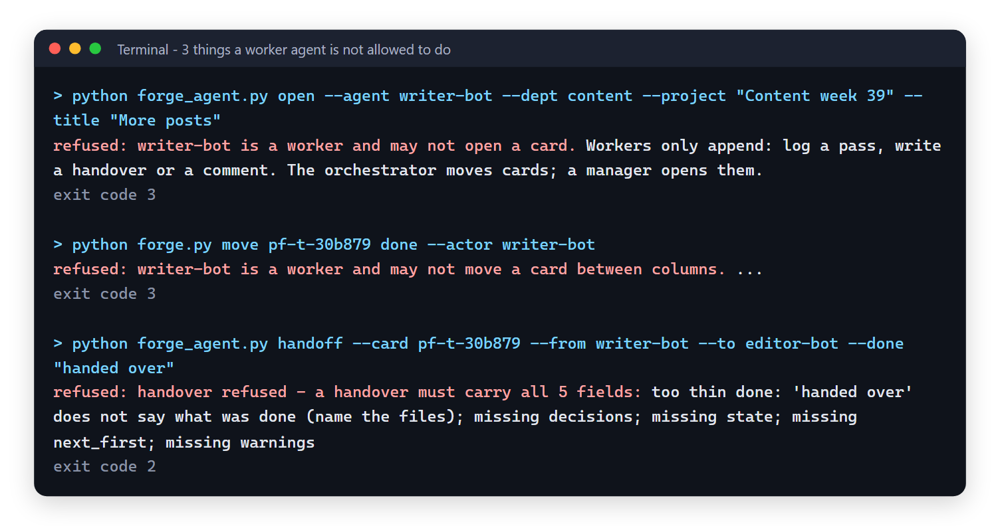

## Pros and cons

| | For | Against |
|---|---|---|
| Cost | The board, the health check and the CRM reader use no AI and cost nothing to run. | Each `/forge-run` is a full Claude Code session. Ashley's 15-minute automatic start ran about 69 of them a day for no work. Only run it when something is ready. |
| Visibility | A single place to see what every agent did, on which job, with which files and what comes next. | Agents only write to it if their instructions say so. Before 2026-06-14, 0 of Ashley's 77 agent files wrote to his board. |
| Safety | Only the orchestrator (the `/forge-run` session) moves cards; only you take a card out of Awaiting You; work that reaches other people stops in Review; refusals show in red. | An agent that gives a false name (for example, typing `--actor you`) gets through. The rules catch mistakes, not an agent that lies about who it is. |
| Handovers | Thin handovers are refused at the database. | Agents need a few extra lines of instruction to write good ones. |
| Busy-work | A queue makes waiting work obvious. | Agents that can open cards may open cards for work nobody needs. Ashley's first week: 3 cards done against 18 times he stepped in. His board on 2026-09-22 had 74 cards in Backlog and 0 being worked. |
| Size | About 5,000 lines of plain Python and plain JavaScript. Your own Claude can read and change all of it. | With 3 to 5 agents, a simple list in your vault may be enough. The board is worth installing once your agents hand work to each other. |
| Time | Install takes about 5 minutes. | Wiring your agents in (the lines for CLAUDE.md and each agent file) takes 20 to 30 minutes. |

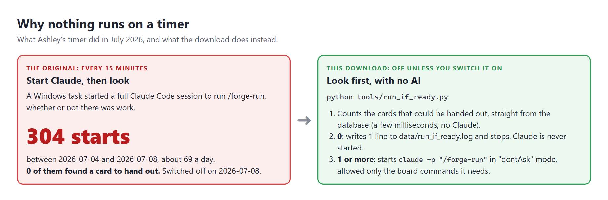

## Before you start

| You need | How to check |
|---|---|
| Python 3.11 or newer (tested on 3.13) | Open a terminal and type `python --version`. On a Mac use `python3 --version`. The installer refuses anything older and changes nothing: Python 3.9 stopped getting security fixes on 2025-10-31 and 3.10 stops on 2026-10-31. |
| Git | `git --version` |
| Claude Code, logged in | `claude --version`. Tested on version 2.1.278 on 2026-09-22. |
| Optional: your second brain vault | You know its folder, for example `C:\Users\<you>\Documents\Second Brain`. If you have not got one, type `none` at question 1 and everything else works the same. |
| Your agents folder | Usually `C:\Users\<you>\.claude\agents` (Windows) or `~/.claude/agents` (Mac). |
| Optional: your CRM vault | The folder that contains `Today.md` (your CRM's ranked list of people to contact today) and `People/`. |
| Optional, for the tests: pytest (a program that runs the download's automatic checks) | `python -m pytest --version`. If missing: `python -m pip install pytest`. |

You do not need Node.js (another programming tool some downloads ask for). Nothing is installed from the internet: the board only uses parts that come with Python.

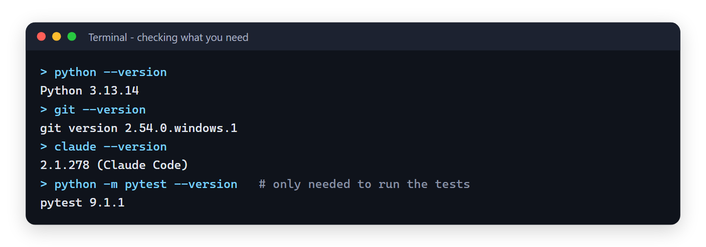

## Install it

1. Open a terminal. Windows: press the Windows key, type `PowerShell`, press Enter. Mac: open Terminal. It opens in your home folder, which is where all 4 downloads in this set go.
2. Download the code and start the installer (on a Mac, type `python3` instead of `python`):

```
git clone https://github.com/OUTLIERS-ai/outliers-ws-03-projectforge; cd outliers-ws-03-projectforge; python install.py
```

3. Answer the 8 questions. Most offer a default in square brackets; press Enter to accept it. Questions 4 and 5 have no default: press Enter for nobody.
   - Question 1: your second brain vault folder, **or `none` if you have not got a vault**. With `none`, questions 7 and 8 answer themselves and the board works exactly the same: the only part you lose is the summary note, which lives in a vault.
   - Question 2: your CRM vault folder, or `none`.
   - Question 3: your agents folder. The installer lists every agent it finds.
   - Question 4: which agents are **managers** (may open cards). Press Enter and only you open cards.
   - Question 5: which agents send work to other people. Their finished cards stop in Review.
   - Question 6: what the board calls you (default `you`). Remember it: you type it after `--actor` (the part of a command that says who is making the change) in terminal commands.
   - Question 7: where the `/forge-run` command goes: `user` (every Claude Code session) or `vault` (only sessions in your second brain).
   - Question 8: the board summary note, a note in your vault that lists the whole board and is rewritten after every change: pressing Enter writes it into your vault at the path shown. Type `none` if you do not want one.
4. The installer shows every file it is about to write and asks "Go ahead?". Type `y`.
5. When it worked you see a list of `done:` lines like this:

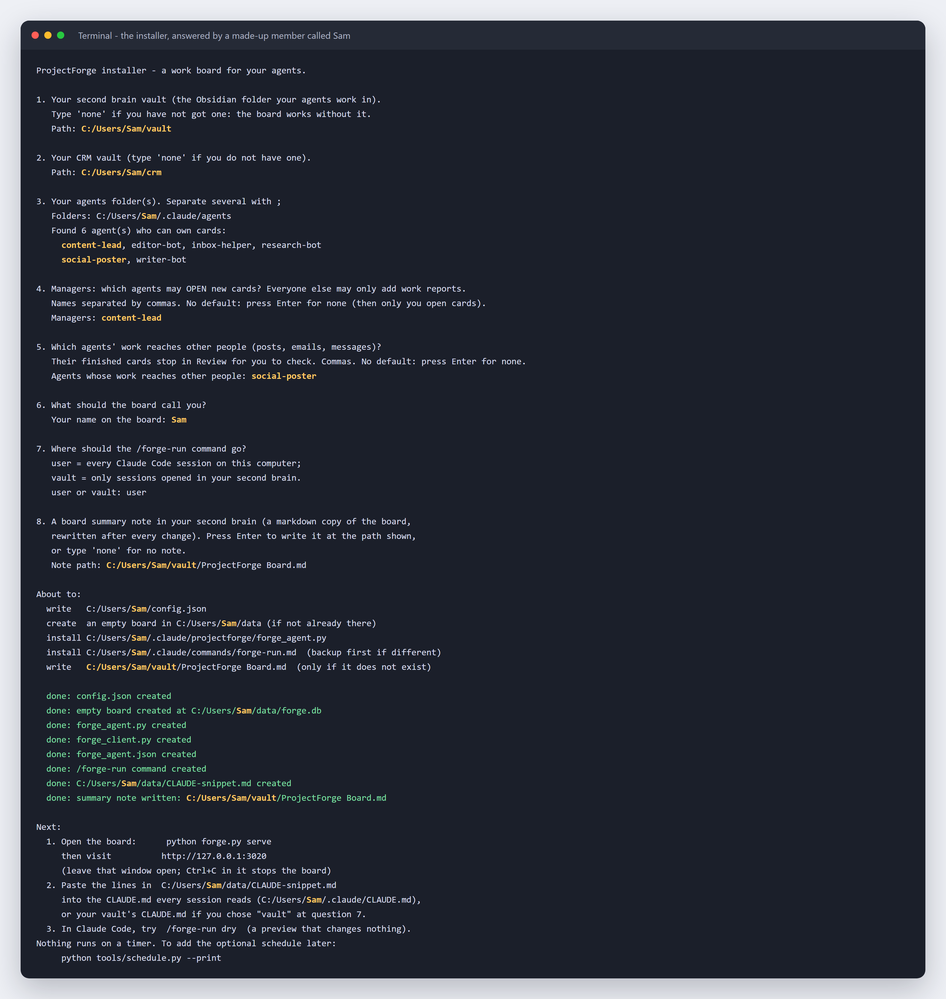


6. Open the board: `python forge.py serve`, then visit `http://127.0.0.1:3020` in your browser (127.0.0.1 means your own computer; nothing goes online). There is no login and no wait. The terminal prints the address and then stays quiet while the board runs. That is normal. Leave the window open; press Ctrl+C in it to stop the board. The name under "ProjectForge" comes from the `workspace` line in `config.json`, the settings file the installer wrote; change it there.

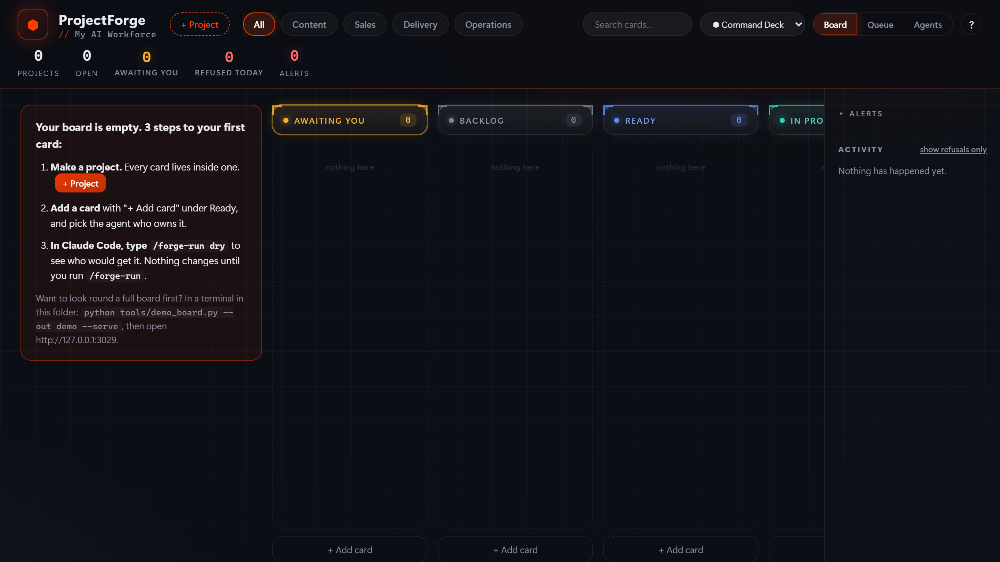

7. The board opens empty, with 3 steps on the left. Your first card: click "+ Add card", which sits **at the top of every column, under its heading**, and use the one under Ready. Because there is no project yet, the form asks you to name one, and the card and the project are made together.

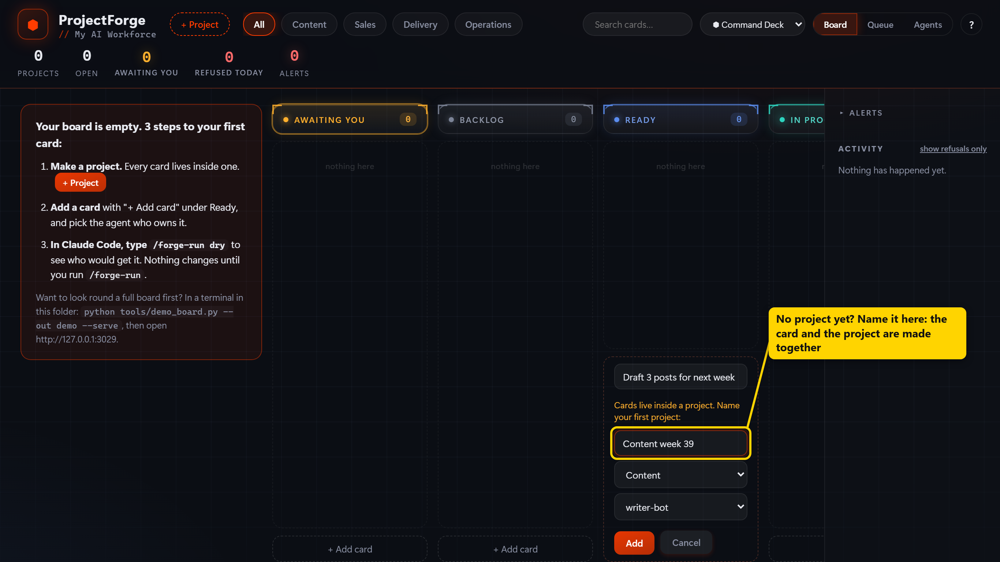

8. Open the file `data/CLAUDE-snippet.md` inside the download folder. Paste the first part into the CLAUDE.md that every session reads, `C:\Users\<you>\.claude\CLAUDE.md` (or the CLAUDE.md in your vault if you chose `vault` at question 7). Paste the second part into each worker agent's file. This is what makes your agents log their work.
9. In Claude Code, type `/forge-run dry`. It reports what it would do and changes nothing.

> **Tip:** Want to see a full board first? Run `python tools/demo_board.py --out demo --serve` and open `http://127.0.0.1:3029`. It builds a separate demo board of made-up work, with a made-up CRM vault, and does not touch your real one.

> **Note:** If a file called `forge-run.md` already exists in your Claude Code commands folder (`.claude\commands` in your home folder), the installer copies it to `forge-run.md.bak-<date>` before replacing it. Running the installer a second time with the same answers changes nothing. `python install.py --uninstall` asks you to type y, then takes the command out, moves the agents' tool into a folder named `projectforge.removed-<date>`, puts your own old command back (even if you installed twice), and leaves your board data alone.

## Using it day to day

**Adding work on the board.** "+ Project" sits at the top of the screen. "+ Add card" sits at the **top** of each column, under its heading, with a project picker and an owner picker, each labelled. The owner picker only lists you and your real agents, so a typo cannot create a made-up agent.

**Finding a card.** The search box filters every tab. If nothing matches what you typed, the board says so and gives you a "Clear the search" button, instead of showing 7 empty columns that look like an empty board.


**Adding work from the terminal.** `forge.py` commands run inside the ProjectForge folder; in a new terminal, type `cd outliers-ws-03-projectforge` first. Make a project first; it prints the project's id, a short code such as `pf-p-5baff3` that you use to add cards to it. Then add a card to it. Every command that changes the board ends with `--actor` and your board name (the answer to question 6; `you` if you kept the default):

```
python forge.py add-project "Content week 39" --dept content --actor you
python forge.py add-task pf-p-5baff3 "Draft 3 posts" --status ready --agent writer-bot --actor you
```

`writer-bot` stands for one of your own agents; type its real name.

The departments are content, sales, delivery and operations; any other is refused. `python forge.py projects` lists every project with its id.

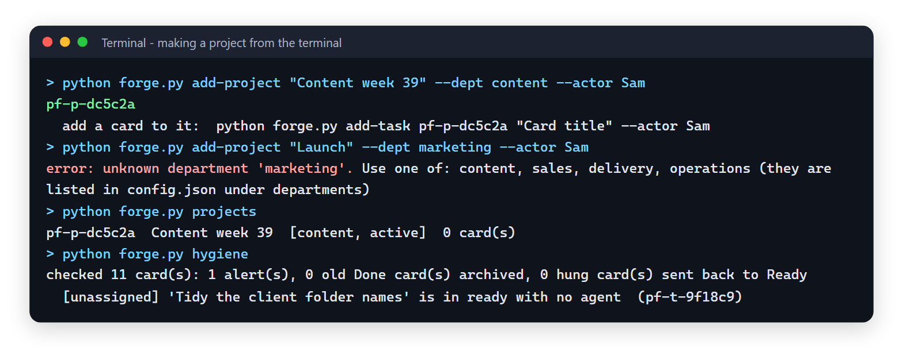

**What your agents run.** The installer puts the agents' tool, `forge_agent.py`, in the `.claude\projectforge` folder inside your home folder. It is not in the download folder, so to try it yourself give its full path (`$env:USERPROFILE` is how PowerShell writes your home folder, `C:\Users\<you>`):

```
python "$env:USERPROFILE\.claude\projectforge\forge_agent.py" open --agent content-lead --dept content --project "Content week 39" --title "Write the newsletter" --assignee writer-bot
```

On a Mac the path is `~/.claude/projectforge/forge_agent.py`. The full list of its commands is under "Every command and setting" below.

**Letting the agents work.** When cards are sitting in Ready, type `/forge-run` in Claude Code (or `/forge-run 3` to run at most 3 cards). The orchestrator:

1. checks how many cards can be handed out, and stops straight away if the answer is 0;
2. moves Backlog cards that have an owner to Ready. It gives an ownerless card an owner only if you set up keyword routing (idea 6 below); otherwise the card waits for you to pick an owner;
3. for each ready card: takes it, starts the owner agent with the card's full history, saves the agent's report, and moves the card to the column its result points to. If the result is "progressed" (partly done), the card goes back to Ready for the next run.

> **Warning:** Backlog cards with an owner do not wait. Any Backlog card with an owner is handed out on the next `/forge-run`. To park a card, give it the tag `someday` (or `icebox` or `parked`).

**Reading a card.** Click anywhere on it. The top shows the owner, the CRM person link and the checklist. Further down are the work reports and the handovers, each with its 5 fields. A handover also makes the receiving agent the card's new owner. Edits at the top are kept when you add a tag, tick the checklist or comment; if you press Escape with unsaved edits, the board asks first. The board refreshes every 10 seconds, but never while you are typing.

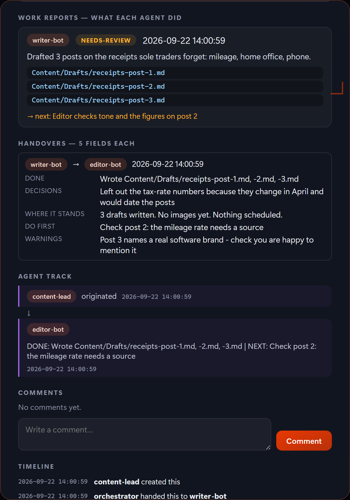

**The Queue tab** shows the Ready cards in the order they would be handed out (priority, then due date, then age) and says why a card cannot go: it has no owner, it is yours, its owner is not one of your agents, or the limit of 10 cards in In Progress at once has been reached.

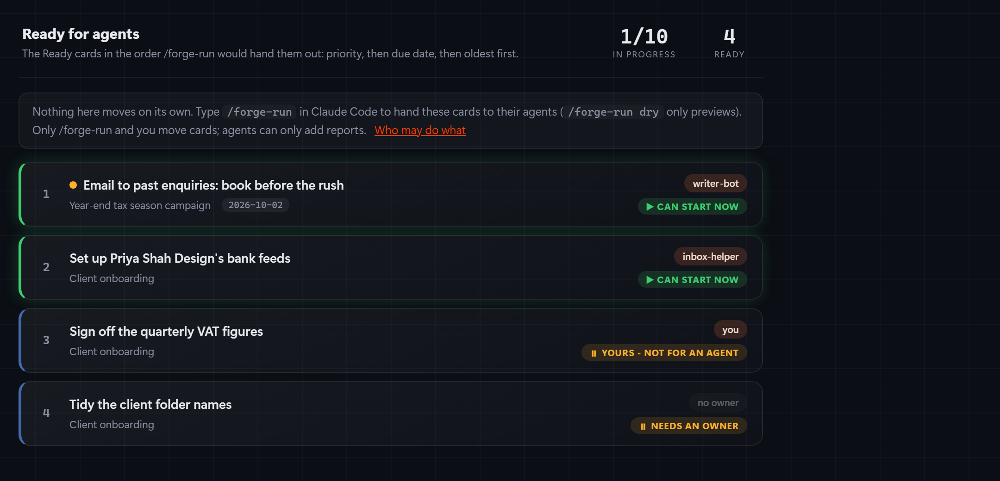

**The Agents tab** shows every agent you installed, managers first, each with a role badge, its open cards and its last 8 results as coloured dots. A key to the dots is at the top.

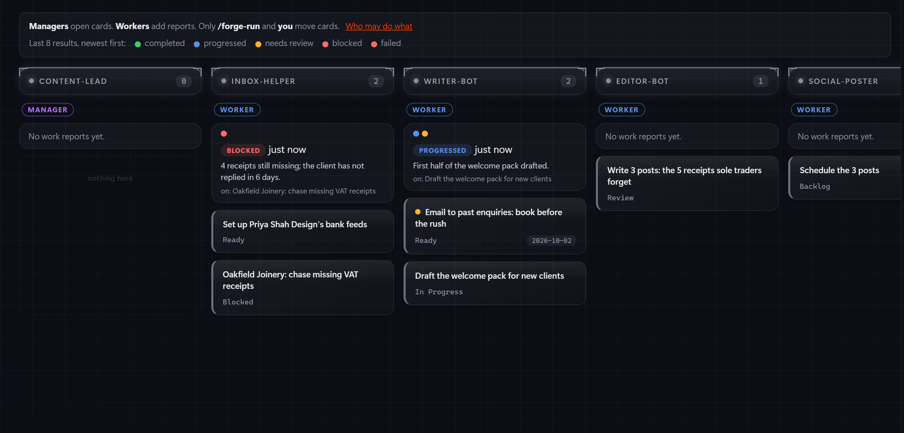

**Your column.** Check Awaiting You once a day. Every card there is waiting for your decision or sign-off. Click the "awaiting you" number at the top to jump to it.

**Refusals and escalations.** The "refused today" number at the top counts the changes the board refused. Click it, or "show refusals only" in Activity, to see who tried what. The wording you see on the board is the plain one; the agent's own terminal gets the longer version naming the options it has to fill in.

**When an agent asks for a person.** An agent that cannot finish without you runs `forge_agent.py escalate`. That leaves 3 marks you cannot miss: a red **NEEDS YOU** label on the card, a **needs you** count in the header, and the card moves into **Awaiting You**, your own column. The health check also raises an alert for it, so it is still there tomorrow after the Activity list has scrolled past it.

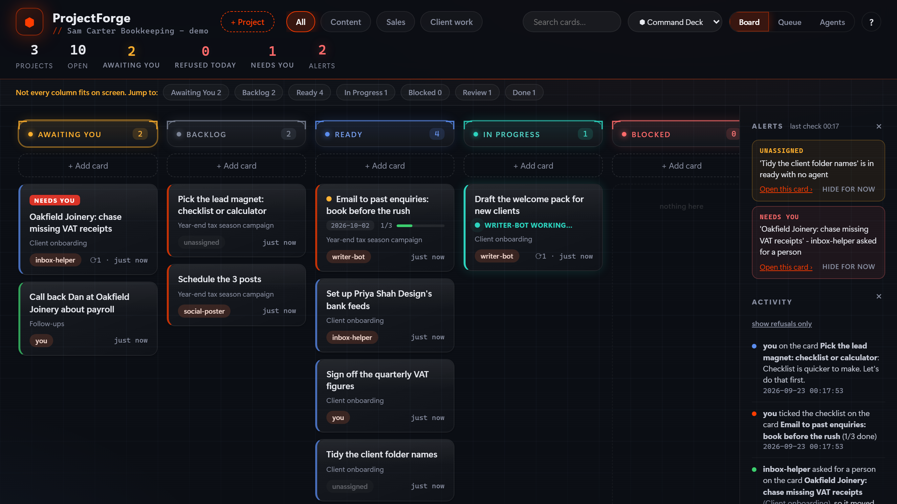

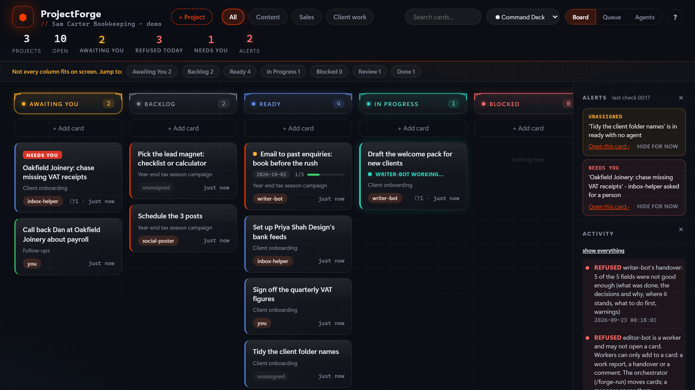

**Health check.** The board runs a no-AI check when it starts and every 10 minutes: overdue, due soon (2 days), untouched for 5 days, stuck in Blocked (3 days), no owner, too many cards in a column, and any card where an agent has asked for a person. The cards it finds are listed under Alerts on the right (with the time of the last check) and at the top of the summary note. It also sends a card back to Ready if its agent never reported within 45 minutes, and archives Done cards after 14 days. `python forge.py hygiene` runs the same check once and prints the cards.

Each alert names its card, and under it sits an "Open this card" link that takes you straight there. "Hide for now" puts an alert away; the next check puts it back if it is still true.

**If the health check ever stops**, the board says so in red where the time of the last check normally sits, and raises an alert naming the reason. It used to print 1 line into the terminal window you had minimised, so the check could be dead for days while the board looked fine.

**The board refreshes every 10 seconds** and pauses only while you are typing: in a box, or in a half-filled "+ Add card" form. When it pauses it says so in an amber line under the header, with the time it last looked. Having a card open no longer stops it: the figures at the top stay right while you read a card.

**Letting it run by itself (optional).** `python tools/run_if_ready.py` checks first and starts Claude only if a card is ready. It prints 1 line and writes what happened to `data/run_if_ready.log`, not the screen; 1 run can take up to 45 minutes. It starts Claude with a Claude Code setting called dontAsk, which refuses anything not on an approved list instead of stopping to ask a question: nobody is there to answer questions, so it may use exactly the board commands below, plus whatever you have already allowed in your own Claude Code settings, and nothing else. This was tested live on 2026-09-22: the board commands ran and every other command was refused.

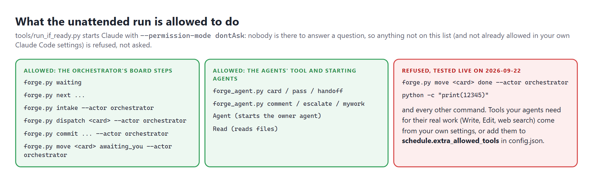

## Fit it to your own AI system

This download is a starting point, not a finished product. It is yours now: change it until it matches how you work. Ashley wrote the first board in 1 day and then changed it for 3 months. His own copy has 5 tabs along the top, not 1: the board, the queue of what would be handed out next, his agents and what each has done, whether the automatic runner is armed, and a map of his whole fleet, which he moved in after ruling that a separate dashboard on its own port was not allowed to exist. It has colour themes, because he wanted a board that suited the room and the hour. He added an 8th column, Tracking, the day he found 18 cards that only reported a status were filling the limit of 10 in progress and nothing could be handed out at all. Then the 5-field handover, after reading a card that said "handed over" and nothing else. Every one of those changes came from using it and finding it wrong.

Each idea below comes with a prompt you can paste into Claude Code, opened in the ProjectForge folder. Some ideas use settings you will find in `config.json` after installing; `config.example.json` shows them all filled in with examples.

### 1. Cards from your CRM's Today page

The download includes `adapters/crm_today.py`. It reads the ranked table on `Today.md` in your CRM vault and makes a card for each person in Awaiting You, linked to that person's note in `People/`. The table needs a rank number, the person's name (matching a file in `People/`), why, and when:

```
| 1 | [[Dan Pike]] | Asked about payroll | Call back today |
```

`[[People/Dan Pike]]` and `[[Dan Pike|Dan]]` work too. Run it with `--dry-run` first (a practice run that shows what it would do and writes nothing): "(no person note found)" means the name does not match a file in `People/`. Running it again updates the same cards instead of copying them. It never sends anything. On the card, and in the summary note, the person's name opens their note in Obsidian. To hand these cards to a research agent instead of you, set `crm_today.owner` in config.json.

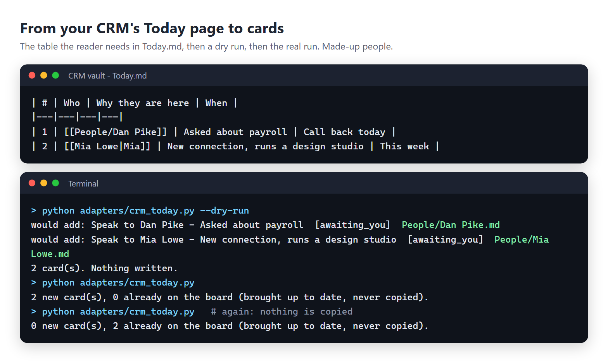

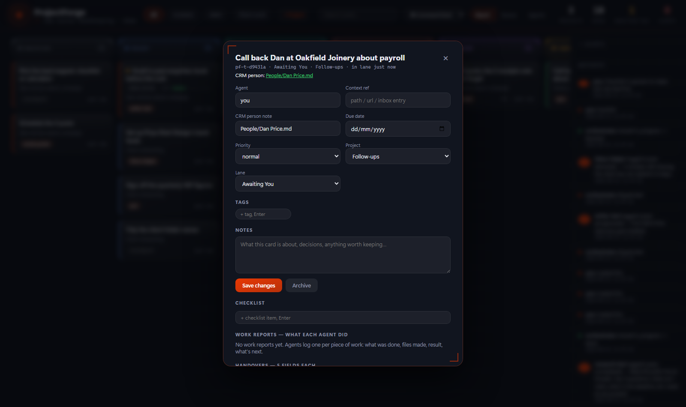

```
Run python adapters/crm_today.py --dry-run and show me the result. If it looks right, run it for real. Then add one line to the script that rebuilds my CRM's Today.md each morning so that after Today.md is rebuilt, crm_today.py runs straight after it.
```

### 2. Your second brain agents as owners and managers

```
Read config.json. Then read every agent file in my agents folder. Suggest which agents should be managers (they plan work and hand it out) and which are workers (they do a single kind of job). Show me the list, and when I agree, re-run python install.py with --managers set to the ones I approve.
```

### 3. Teach each agent to leave a proper report

```
Open data/CLAUDE-snippet.md. For each worker agent file in my agents folder, add the WORK REPORT paragraph at the end if it is not already there, and add a line telling it to save that report with forge_agent.py pass (the command that records a work report). Show me the change for each file before saving it, and back up each file first.
```

### 4. Content engine runs as cards

```
Read my content engine folder at <path to your content engine>. Write adapters/content_engine.py, modelled on adapters/crm_today.py, that creates a card per content piece the engine has made in the last 7 days, with the draft's file path in context_ref (the card's link-or-file field), owned by my editor agent, starting in Review. It must never publish anything. Add "content-engine" to federate_sources in config.json (the list of programs allowed to send cards in). Add a test in tests/ and run python -m pytest -q.
```

### 5. "Awaiting You" in your daily note

```
Write tools/daily_block.py. It reads the board and writes a section called "Waiting for me" into today's daily note in my second brain (find the daily notes folder by looking at my vault), listing every card in Awaiting You and every card in Review. Replace only that section, never the rest of the note, and save it through a temporary file and os.replace, so a crash can never leave the note half-written. No AI.
```

### 6. Route cards by keyword

```
In config.json, fill intake.routing (the keyword rules that pick an owner) so that a card with "podcast" in its title goes to my podcast agent, "invoice" goes to my admin agent, and "thumbnail" goes to my design agent. Use the real agent names from config.json "agents". Then add a test to tests/test_store.py proving a card is routed correctly, and run the tests.
```

### 7. Every card must name the number it moves

Ashley's worry about busy-work was agents creating work to stay busy. A cure is to refuse any card that does not say which goal it serves.

```
Add a "goal" field to cards in engine/db.py (with a migration like the others). Make open_card refuse a card whose goal is empty, with a clear message. Show the goal on the card in the web board. Add tests for the refusal and run python -m pytest -q.
```

### 8. The optional schedule, set up safely

```
Run python tools/schedule.py --print and explain each line to me. Then set schedule.model in config.json to "sonnet" (Anthropic's mid-priced model) and schedule.every_min to 120. List the tools my agents need for their work that are not in allowed_tools() in tools/run_if_ready.py, and suggest what to put in schedule.extra_allowed_tools. Do not run python tools/schedule.py --install until I say yes.
```

### 9. Limits per agent

The file name decides which agent a limit file applies to: `cards/writer-bot.json` limits writer-bot.

```
For my 3 busiest worker agents, create a file in cards/ modelled on cards/example-agent.json.example, named after the agent (for example cards/writer-bot.json), and set its "slug" (the agent-name field) to the agent's exact name. Limit each to its own department and to 5 hand-outs a day. Run python forge.py cards --validate and show me the result.
```

## Every command and setting

The whole download at a glance, then every command. Anything that changes the board from the terminal needs `--actor <your board name>`.

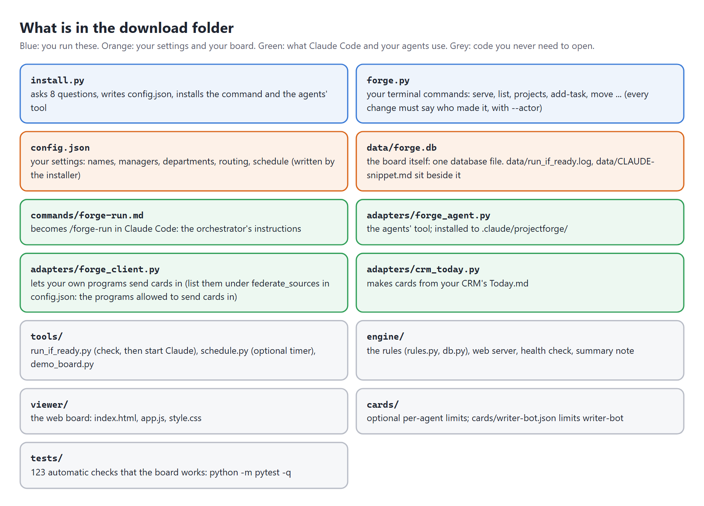

**`forge.py`: your commands.** Parts in [square brackets] are optional; leave them out to use the default.

| Command | What it does |
|---|---|
| `serve [--port 3020]` | Opens the web board and runs the health check every 10 minutes. |
| `daemon [--port] [--interval 10]` | The same as serve, with its own minutes between health checks. |
| `list` | Open cards in the terminal. |
| `projects` | Every project and its id. |
| `add-project "Title" --dept content [--summary "..."] --actor you` | A new project; prints its id. |
| `add-task <project-id> "Title" [--status ready] [--agent writer-bot] [--notes "..."] [--context <link or file>] [--crm-person "People/Dan Pike.md"] --actor you` | A new card. The 8 columns are backlog, ready, in_progress, blocked, review, awaiting_you, done, tracking. |
| `move <card> <column> --actor you` | Moves a card. |
| `set <card> [--due 2026-10-02] [--priority low/normal/high/urgent] [--agent <name>] [--crm-person ...] --actor you` | Changes a card's details. A due date must be written as YYYY-MM-DD; anything else is refused and nothing changes. `--due ""` clears it. |
| `archive <card> [--restore] --actor you` | Hides a card, or brings it back. Nothing is ever deleted. |
| `comment <card> "text" --actor you` | Adds a comment. |
| `pass <card> <agent> "summary" [--result ...] [--outputs a.md,b.md] [--next "..."] [--intent ...]` | Saves a work report for an agent. Never moves the card. |
| `handoff <card> <from> <to> --done --decisions --state --next-first --warnings [--context]` | A 5-field handover from the terminal. |
| `waiting [--json]` | How many cards a `/forge-run` could hand out now, counting owned Backlog cards it will move to Ready first. Writes nothing. |
| `next [--limit 5] [--json]` | The Ready cards in hand-out order, with the reason any card cannot go. |
| `show <card> [--json]` | A card in full. |
| `metrics [--days 7]` | Cards finished, cards moved back to an earlier column, how often you stepped in. |
| `hygiene` | Runs the health check once and lists the cards it found. |
| `mirror` | Rewrites the summary note now. If the folder it should go in is not there, it refuses and names the folder rather than making one. |
| `cards [--validate]` | Lists or checks the per-agent limit files. |
| `intake`, `dispatch <card>`, `commit <card> <agent> "summary" --result ... [--key]` with `--actor orchestrator` | The orchestrator's own steps: intake moves owned Backlog cards to Ready, dispatch takes a card, commit saves the report and moves the card. `--key` stops the same report being saved twice. |

Results are completed, progressed, blocked, failed and needs-review. `--intent` (on pass, handoff and commit) records what kind of message it is: DELEGATE, REQUEST, INFORM, PROPOSE, ACCEPT, REFUSE, FAILURE, QUERY or ESCALATE.

**`forge_agent.py`: your agents' tool.** It writes straight into the database, so it works whether or not the web board is open. It finds the board through `forge_agent.json` next to it, or an environment variable (a named setting your computer passes to every program) called `FORGE_DIR`.

| Command | Who |
|---|---|
| `mywork <agent>` | Anyone: the agent's open cards and last report. |
| `card <card>` | Anyone: reads a card, its last 2 handovers and last 4 reports. |
| `pass --card --agent --summary [--result] [--outputs] [--next] [--key]` | Any agent. Saves a work report. |
| `handoff --card --from --to --done --decisions --state --next-first --warnings [--context]` | Any agent. Makes the receiver the owner. |
| `comment --card --agent --text` | Any agent. |
| `escalate --card --agent --note` | Any agent. Marks the card NEEDS YOU, counts it in the header, moves it into Awaiting You and raises an alert. |
| `open --agent <manager> --dept --project --title [--assignee] [--status backlog/ready] [--context] [--notes] [--crm-person]` | Managers only. A new project name makes a new project. |

**Other scripts.** `install.py` also takes every answer as a setting, for scripts: `--yes`, `--second-brain`, `--crm`, `--agents-dir`, `--managers`, `--outward`, `--name`, `--commands`, `--summary-note`, `--port`, and `--uninstall`. `tools/run_if_ready.py [--dry-run]` checks and starts Claude only if needed. `tools/schedule.py --print / --install [--every 60] / --remove` shows, switches on or switches off the optional schedule (a hidden Windows task, or an entry in launchd, the Mac's built-in scheduler). `tools/demo_board.py --out demo [--serve] [--port 3029]` builds the demo. `adapters/forge_client.py` lets your own programs send cards to the board over its web address.

**Settings in `config.json`.**

| Setting | What it controls |
|---|---|
| `workspace`, `human`, `orchestrator` | The name under the logo, your board name, the orchestrator's name. |
| `managers`, `agents`, `outward_owners` | Who may open cards; your real agents (the owner picker); whose finished work stops in Review. |
| `departments` | The 4 departments, their colours, and an optional `lead` agent who gets ownerless cards. |
| `hygiene` | `check_every_min` 10, `stale_days` 5, `blocked_days` 3, `due_soon_days` 2, `done_archive_days` 14, `dispatch_ttl_min` 45 (minutes before a taken card whose agent never reported goes back to Ready), and the column limits: In Progress 10, Review 8, Awaiting You 10. |
| `intake` | `auto_pickup` (whether `/forge-run` moves owned Backlog cards to Ready), the parking tags, and keyword `routing`. |
| `crm_today.owner` | Give CRM cards to an agent instead of you. |
| `federate_sources` | Programs allowed to send cards in (default `crm-today`). Anything else is refused. |
| `schedule` | `every_min`, `model`, `extra_allowed_tools`, and `claude_path` (saved when you install the schedule). |
| `summary_note`, `second_brain`, `crm_vault`, `port`, `db_path` | Folder paths, the board's port and its database file. |

**The board itself.** Search box and department buttons filter every tab. 5 colour themes (Command Deck, Synthwave, Terminal, Paper and Minimal) sit in the menu at the top. Drag a card between columns, or up and down inside a column; dragging a card that an agent is still working on into Done asks first. A card has tags, a due date, a priority, notes, a checklist and an archive button. The **×** on an alert dismisses it. Keyboard users can Tab to a card and press Enter to open it.

**The web address, for your own programs.** The board answers on `http://127.0.0.1:3020/api/...`. Reads: `state`, `events`, `agents`, `alerts`, `metrics`, `cards`, `next`, `waiting`, `task/<card>`. Writes (in JSON, the standard text format programs use to swap data; only from your own computer, and each must name an `actor`): `open`, `pass`, `handoff`, `federate` (another program sending cards in), `task/add`, `task/move`, `task/update`, `task/tags`, `task/checklist`, `task/comment`, `task/archive`, `task/reorder`, `project/add`, `project/update`, `alert/dismiss`, and the orchestrator's `intake`, `dispatch`, `commit`.

**Also in the folder:** `README.md`, `WHAT-I-STOLE.md` (the ideas this borrows and their licences), `LICENSE` (MIT: anyone may use and change the code), `guide/` (this guide and its pictures), and `tests/` (115 automatic checks that the board works: `python -m pytest -q`; they never need a particular port to be free, so they pass while the board is running).

## When it goes wrong

These are the real faults from Ashley's build and from testing this download, with the fix for each.

| What you see | Why | Fix |
|---|---|---|
| Your Claude usage climbs while nothing gets done. | A timer is starting Claude on an empty board. This was Ashley's biggest automatic cost in July 2026. | Never put `claude -p "/forge-run"` on a timer. Use `tools/run_if_ready.py`, which exits without starting Claude when nothing is ready. |
| Nothing is ever handed out, but cards sit in Ready. | The in-progress limit (default 10) is full, or the owner is not one of your agents. In the original, 18 cards that only showed a status from another system filled the limit. | Open the Queue tab: it says why each card is waiting. Put cards that only report a fact from another system in Tracking, which never counts. |
| A card jumps back to an older column. | Another program re-sent it with its old column. | Already fixed: once the orchestrator takes a card, or while it is in Awaiting You, a re-send can no longer change its column. |
| "refused: ... is a worker and may not move a card" | The rule that only the orchestrator (`/forge-run`) and you move cards. An agent tried to move a card. | Working as intended. The agent should save a work report with `forge_agent.py pass`; `/forge-run` moves the card. |
| "handover refused - a handover must carry all 5 fields" | A handover with a field missing or too short to be useful. | Fill in `--done` (name the files), `--decisions` (with "because"), `--state`, `--next-first` and `--warnings` ("none" is fine). |
| "the following arguments are required: --actor" | Every `forge.py` change must say who made it. | Add `--actor` and your board name, for example `--actor you`. |
| "no project with the id ..." | A wrong project id. | `python forge.py projects` lists them. |
| "unknown department 'marketing'" | Only the departments in config.json are accepted. | Use content, sales, delivery or operations, or add a department to config.json. |
| "Port 3020 is already in use" | A second copy of the board, or another program, has the port. | Close the other board's terminal window, or run `python forge.py serve --port 3021`. |
| Your vault note was overwritten by a demo board. | During research on 2026-09-22, a copied settings file still pointed at a real vault note. It was restored from git. | The demo board never writes a summary note, and the installer shows the note's path before writing it. |
| The orchestrator reports "bad json". | In the original, an em dash typed into a command's text broke the request. | `/forge-run` now uses `forge.py` commands instead of web requests. Still type hyphens, not em dashes. |
| An agent says the board was not found. | `forge_agent.json` is missing next to the tool. | Re-run `python install.py`. Or set an environment variable (a named setting your computer passes to programs) called `FORGE_DIR` to the download folder. |
| The unattended run logs "claude not found" (Mac). | A scheduled job on a Mac does not get the list of folders your terminal searches for programs, so it cannot find `claude`. | `python tools/schedule.py --install` saves Claude's full path and adds its folder to the schedule. |
| "a due date must be written as YYYY-MM-DD" | You typed a date in words or in day/month/year order. Before 2026-09-23 the board took it and the health check then died on that card every time. | Write it as `--due 2026-10-02`. `--due ""` clears a due date. The web board's date box already gets this right. |
| An alert saying a card's due date cannot be read. | A bad due date saved before this fix, or put there by one of your own scripts. | Open the card and set the date again as YYYY-MM-DD, or clear it. Until you do, that card alone is skipped; every other card is still checked. |
| "THE CHECK HAS STOPPED", in red where the time of the last check sits. | The health check hit something it could not read. The board still serves; the 4 jobs the check does have stopped. | Read the alert beside it: it names the reason. Run `python forge.py hygiene` in a terminal to see the same message in full. |
| A wall of error text from every command, mentioning JSON. | `config.json` was edited by hand and broken: usually a comma after the last setting. | The message now names the line. Fix that line and save as plain UTF-8, or delete the file and run `python install.py` again. A file saved by Notepad as "UTF-8 with BOM" is read without complaint. |
| The CRM reader stops with an error about a byte it cannot decode. | Fixed on 2026-09-23. `Today.md` had been saved in the old Windows text format (Windows-1252), which any older Windows tool may still write. | Nothing crashes now. An accent or a pound sign in a name may come back wrong on the card, for example "Renee Cafe" as "Ren?e Caf?"; save `Today.md` as UTF-8 to fix the spelling. |
| The uninstall says it could not move a folder aside. | Something has a file in `.claude\projectforge` open: an editor, a terminal sitting in that folder, or a running agent. | Close it and run `python install.py --uninstall` again. Nothing was changed, so it is safe to repeat. |
| "the summary note was not written: the folder ... is not there". | Your vault has been renamed or moved, or a OneDrive vault has not synced yet. | Check the folder exists, then run `python forge.py mirror`. The board never makes a folder inside your vault, because it used to make an empty folder and report success. |
| A card carries a red NEEDS YOU label. | An agent ran `escalate`: it cannot finish without a person. The card has moved into Awaiting You. | Read the note in the Activity list or on the card, do the part only you can do, then move the card on. Moving it out of Awaiting You takes the label off. |

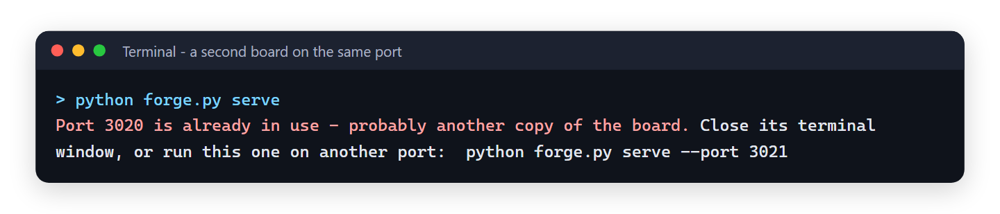

## Download

The code: https://github.com/OUTLIERS-ai/outliers-ws-03-projectforge

Clone and install with a single command:

```
git clone https://github.com/OUTLIERS-ai/outliers-ws-03-projectforge; cd outliers-ws-03-projectforge; python install.py
```

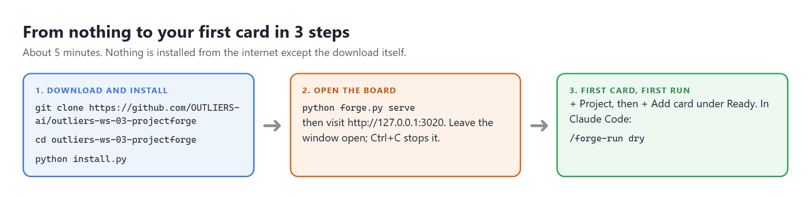
